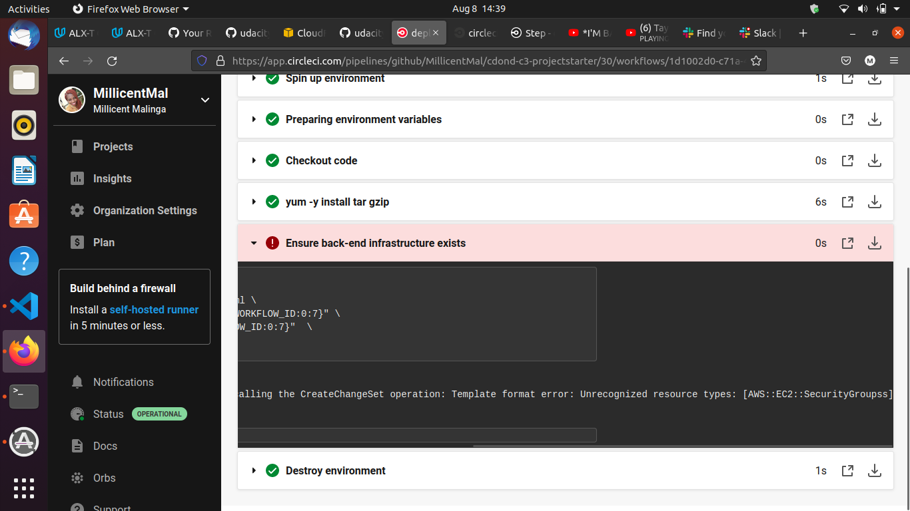
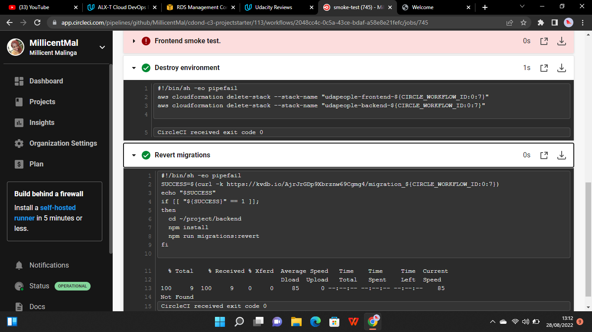
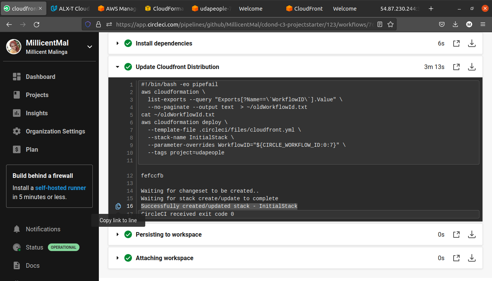
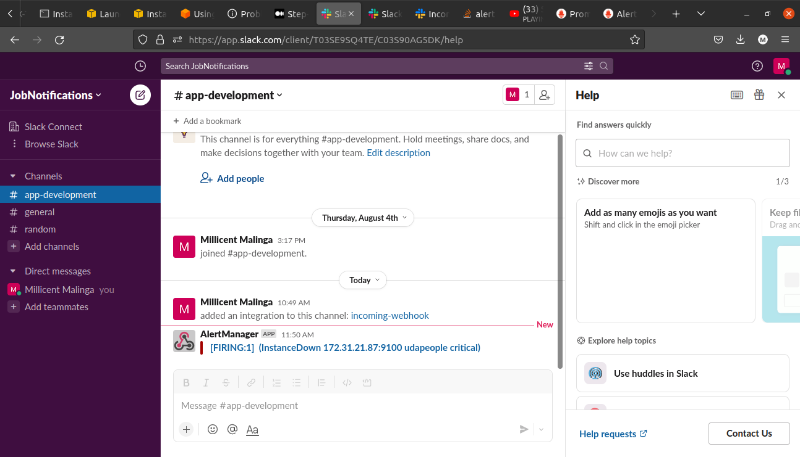

## Give Application Auto-Deploy Superpowers (Udacity Cloud DevOps Engineering Project)
This project, is proof of mastery of the following learning objectives:

- Explain the fundamentals and benefits of CI/CD to achieve, build, and deploy automation for cloud-based software products.
- Utilize Deployment Strategies to design and build CI/CD pipelines that support Continuous Delivery processes.
- Utilize a configuration management tool to accomplish deployment to cloud-based servers.
- Surface critical server errors for diagnosis using centralized structured logging.

### Instructions

* [Selling CI/CD](instructions/0-selling-cicd.md)
* [Getting Started](instructions/1-getting-started.md)
* [Deploying Working, Trustworthy Software](instructions/2-deploying-trustworthy-code.md)
* [Configuration Management](instructions/3-configuration-management.md)
* [Turn Errors into Sirens](instructions/4-turn-errors-into-sirens.md)

### Project Submission

### URLS FOR SUCCESSFUL DEPLOYMENT

The URL Screenshots represent the complete project output. 
1. Showing the S3 Bucket working
 
2. Cloudfront distribution URL
 
 3. Backend URL
  
4. Promethus monitoring server

  1. Job failed because of compile errors. 
 
  2. Job failed because of unit tests.
  
  3. Job that failed because of vulnerable packages. 
  
 4. An alert from one of your failed builds. 
  
  5. Appropriate job failure for infrastructure creation. 
  
  6. Appropriate job failure for the smoke test job.
  
  7. Successful rollback after a failed smoke test. 
  
  8. Successful promotion job. 
  
  9. Successful cleanup job. 
  
  10. Only deploy on pushed to `master` branch. 
  
  11. Provide a screenshot of a graph of your EC2 instance including available memory, available disk space, and CPU usage.
  
   
   

  1. Provide a screenshot of an alert that was sent by Prometheus.
  

- Your presentation should be in PDF format named "presentation.pdf" and should be included in your code repository root folder. 

Before you submit your project, please check your work against the project rubric. If you haven’t satisfied each criterion in the rubric, then revise your work so that you have met all the requirements. 

### Built With

- [Circle CI](www.circleci.com) - Cloud-based CI/CD service
- [Amazon AWS](https://aws.amazon.com/) - Cloud services
- [AWS CLI](https://aws.amazon.com/cli/) - Command-line tool for AWS
- [CloudFormation](https://aws.amazon.com/cloudformation/) - Infrastrcuture as code
- [Ansible](https://www.ansible.com/) - Configuration management tool
- [Prometheus](https://prometheus.io/) - Monitoring tool

### License

[License](LICENSE.md)

